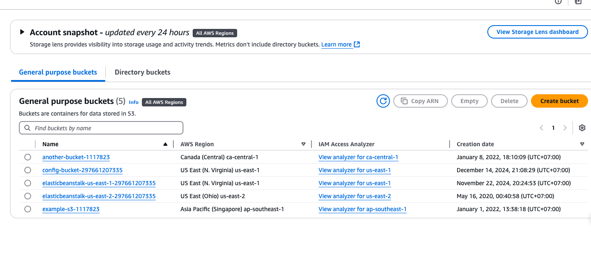

1. Add rule

2. Select required-tags

3. Add required tag

4. Create bucket that has no tags

4.1. Go to IAM role to config role for config access s3 to remediation

5. Add auto remediation

6. Verify
